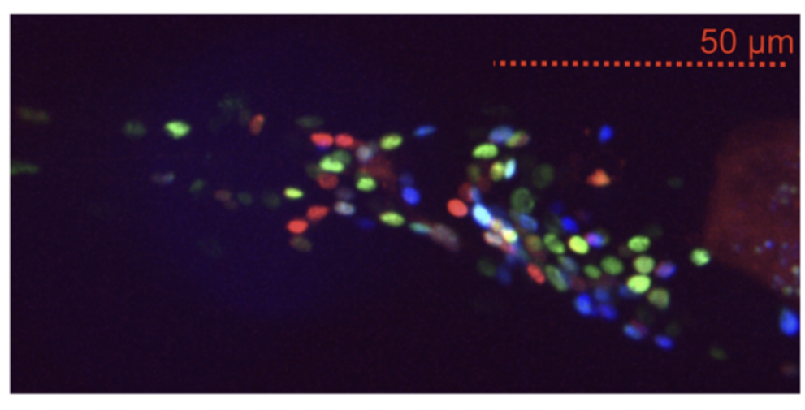
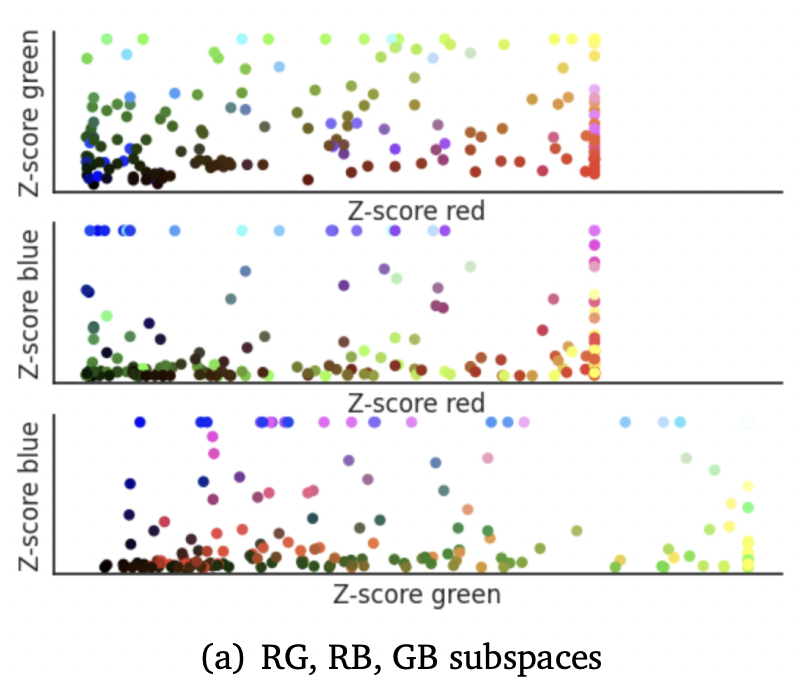
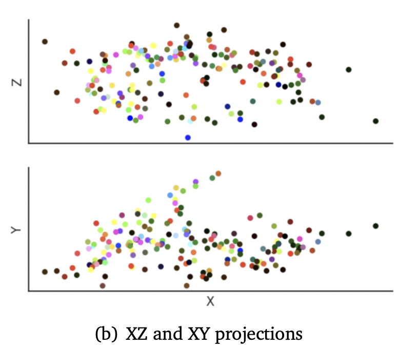
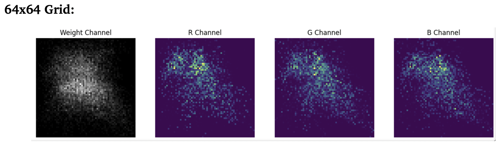
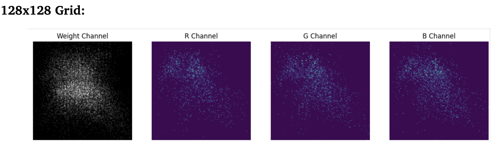
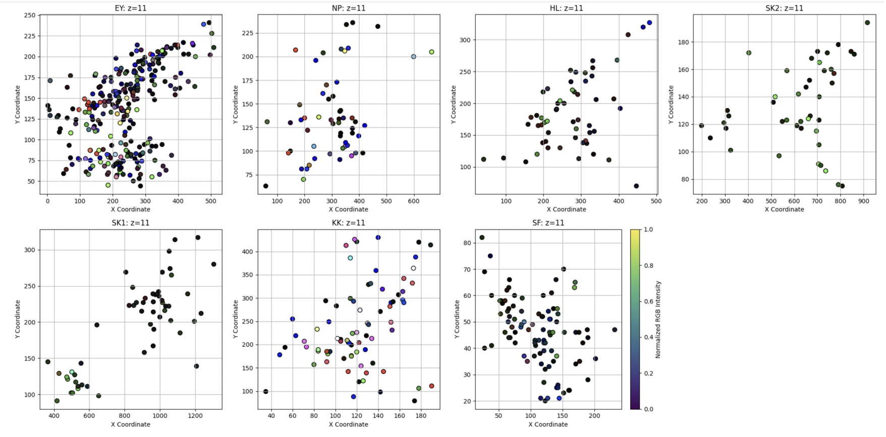
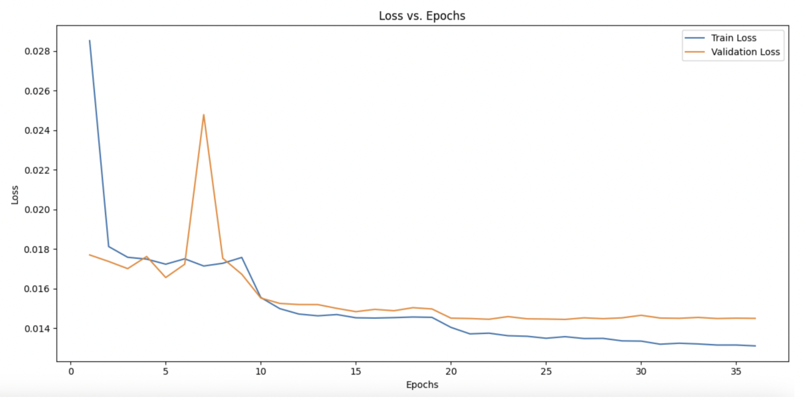
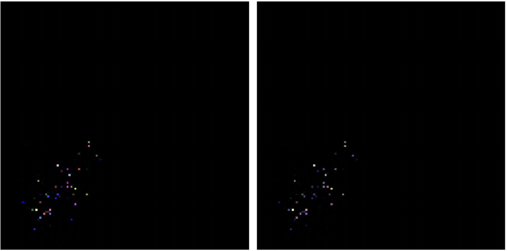
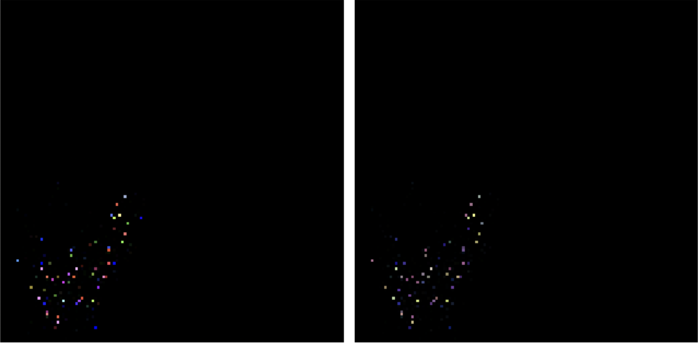

# Neural Image Colorization using ResNet

This project implements a **ResNet-based deep learning pipeline** for colorizing grayscale *C. elegans* neuroimaging data, derived from the **WormID NeuroPAL** dataset. By predicting RGB values from voxel-level spatial and grayscale features, the model enhances both **visual interpretability** and **classification accuracy** of neuron types.

---

## 📁 Repository Structure

```
├── Data_Loading.ipynb                         # Loads voxel and label data from NWB files
├── Data_Preprocessing_(Normalization_GridMapping).ipynb  # Grid conversion & normalization
├── Final_ResNetModel.ipynb                    # ResNet model trained with background class
├── Final_ResNetModel-NoBG.ipynb               # ResNet trained without background class
├── Final_ResNetModel-NoBG-SMOTE.ipynb         # ResNet with SMOTE oversampling
├── Initial_Classification_Results.ipynb       # Classification results using predicted RGB
├── CV_Final_Project_Report.pdf                # Full project report
└── Project_Proposal.pdf                       # Initial proposal
```

---

## Background

Neuroimaging data in *C. elegans* is often grayscale and lacks contrast for neuron identification. We address this by applying a **deep residual network (ResNet-18)** that learns to map grayscale voxel representations to accurate color (RGB) outputs, enabling better interpretability and facilitating downstream classification.

---

## Data & Preprocessing

We use voxel data from NWB files, including:
- `xr`, `yr`, `zr`: Scaled spatial coordinates  
- `weight`: Voxel intensity  
- `R`, `G`, `B`: Raw RGB intensity values  
- `ID`: Neuron label  

### Visualizations

#### Raw NeuroPAL Structural Volume
<p align="left">
  
</p>

### 2D Projections

<p float="left">
  
  
</p>


### Grid Mapping

Voxel coordinates `(xr, yr)` are mapped to a **2D grid** of either `64×64` or `128×128`. Each grid cell contains:
- **Channel 1**: Grayscale value from RGB  
  `Gray = 0.299 * R + 0.587 * G + 0.114 * B`
- **Channel 2**: Voxel `weight`

Grid Resolution Comparison

<p align="left">
  
</p>

<p align="left">
  
</p>


### Auxiliary Feature

- The scalar `zr` is processed using a fully connected branch and expanded spatially to match the grid dimensions.

### Normalization

- RGB and weight values are **globally normalized** across all datasets.
- Spatial coordinates `(xr, yr, zr)` are **individually normalized** within each dataset to preserve structure.

#### 2D Projections of Normalized Data (XY Plane)
<p align="center">
  
</p>

---

## 📊 Baseline Comparison

We compared classification accuracy using traditional Random Forest classifiers on two feature sets:

| Feature Type        | Accuracy | Notes |
|---------------------|----------|-------|
| Grayscale only      | 0.2324   | High background bias, poor separation |
| Grayscale + RGB     | 0.4009   | Significantly improved performance for neurons like ADEL and ADER |

---

## Model Architecture

### ResNet-18 (Modified)

- Adjusted to accept **2-channel input** (grayscale + weight)
- Auxiliary scalar `zr` handled by a separate MLP
- Fusion of ResNet and auxiliary features via **channel concatenation**
- Final convolutional layers predict **3-channel RGB** output

## Training Configuration

| Component        | Description                                  |
|------------------|----------------------------------------------|
| Loss             | Mean Squared Error (MSE)                     |
| Optimizer        | Adam (lr = 0.001, weight decay = 1e-4)       |
| Scheduler        | ReduceLROnPlateau                            |
| Early Stopping   | Patience = 10 epochs                         |

---

## Results

| Configuration            | MSE     | SSIM   | Colorfulness |
|--------------------------|---------|--------|---------------|
| Full Dataset (w/ BG)     | 0.0144  | 0.7300 | 0.1341        |
| No Background (cleaned)  | 0.0197  | 0.7143 | 0.1565        |


### Loss Curves

<p align="left">
  
</p>

### Prediction vs. Ground Truth

#### Example 1
<p align="left">
  
</p>

#### Example 2
<p align="left">
  
</p>

#### Example 3
<p align="left">
  
</p>

---

## Downstream Classification

Predicted RGB values were used as features in standard classifiers:

| Classifier     | Accuracy |
|----------------|----------|
| Random Forest  | 0.2295   |
| SVM            | 0.2581   |
| KNN            | 0.2479   |
| MLP            | 0.2352   |
| Logistic Reg.  | 0.2575   |

> Colorization enhances visual data, but **class imbalance** limits classification performance.

---

## Conclusion

- **ResNet-18** effectively predicts RGB color from grayscale + spatial inputs.
- Colorization improves both **visual clarity** and **classification readiness**.
- Main bottleneck: data scarcity and severe **class imbalance**.

---
